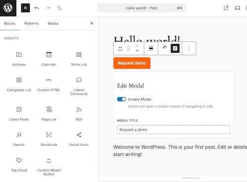

=== AZBlocks Modular Modal ===
Contributors: Andres Zepeda
Tags: block, modal, button, gutenberg, acf
Tested up to: 6.6
Stable tag: 1.0.0
License: GPL-2.0-or-later
License URI: https://www.gnu.org/licenses/gpl-2.0.html
Requires at least: 6.0
Requires PHP: 7.4

== Description ==

The AZBlocks Modular Modal plugin is a modal window component that includes a form and can be added to any WordPress theme that uses Advanced Custom Fields (ACF).

**Key Features:**

-   **Button:** A button that, when clicked, opens a modal window containing a form. Style this button
    the same as the submit button in the form in the modal window
-   **Modal Window:** Styled to match the Figma design, including form layout and text elements
-   **ACF Integration:** Use ACF to control the following:
    -   Button Text
    -   Button Link
    -   Boolean toggle to enable/disable the modal window
    -   Modal form title text

== Installation ==

**Automatic Installation:**

1. In your WordPress admin dashboard, navigate to Plugins > Add New
2. Search for "azblocks-modular-modal"
3. Click "Install Now" and then "Activate"

**Manual Installation:**

1. Download the plugin files
2. Upload the `azblocks-modular-modal` folder to the `/wp-content/plugins/` directory
3. Activate the plugin through the 'Plugins' screen in WordPress

**Requirements:**

-   WordPress 6.0 or higher
-   PHP 7.4 or higher
-   Advanced Custom Fields (ACF) plugin (recommended for full functionality)

**Post-Installation Setup:**

1. Ensure ACF is installed and activated for the best experience
2. The plugin will automatically register ACF field groups for modal content
3. Start using the "Modal Button" block in the Gutenberg editor

== Usage in Themes ==

**Basic Usage:**

1. **Adding Modal Buttons in Gutenberg Editor:**

    - In the block editor, search for "Modal Button" block
    - Add the block to your post or page
    - Configure button text, modal title, and content
    - Publish your content

== Screenshots ==

  
  
ACF field groups for modal content management

== Changelog ==

= 1.0.0 =

-   Initial release
-   Custom Gutenberg block for modal buttons
-   ACF integration for content management
-   Template-based architecture
-   Accessible modal implementation
-   Theme integration support
-   Hooks and filters for customization

== Development ==

**Building the Plugin:**

The plugin uses WordPress Scripts for building. To modify and build:

1. Clone the repository
2. Run `npm install` to install dependencies
3. Run `npm run start` for development with hot reload
4. Run `npm run build` for production build

**File Structure:**

-   `/src/` - Source files for the block
-   `/build/` - Compiled block assets
-   `/inc/` - PHP includes and functionality
-   `/template-parts/` - Template files for modal rendering
-   `/acf-json/` - ACF field group definitions
